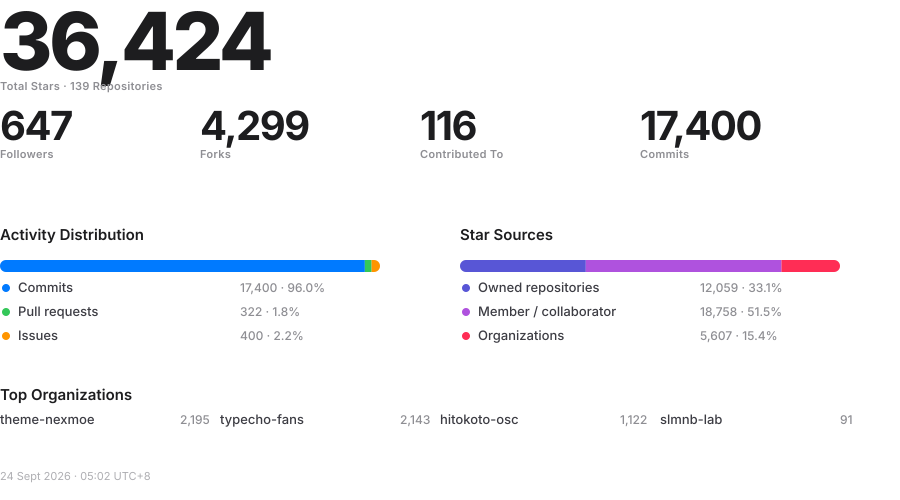

# Nexmoe

Open-source tools for video, audio, AI, and the web.

[Website](https://nexmoe.com) · [All projects](https://github.com/nexmoe?tab=repositories) · [Data notes](docs/README_DATA_METRICS.md)

## Overview

## Repositories

<!-- repo_rankings starts -->
### [Huanshere/VideoLingo](https://github.com/Huanshere/VideoLingo)

Netflix-level subtitle cutting, translation, alignment, and even dubbing - one-click fully automated AI video subtitle team | Netflix级字幕切割、翻译、对齐、甚至加上配音，一键全自动视频搬运AI字幕组

### [nexmoe/VidBee](https://github.com/nexmoe/VidBee)

Download videos from almost any website worldwide

### [typecho-fans/plugins](https://github.com/typecho-fans/plugins)

Typecho Fans插件作品目录

### [theme-nexmoe/hexo-theme-nexmoe](https://github.com/theme-nexmoe/hexo-theme-nexmoe)

🔥 A special Hexo theme focusing on pictures and images. Images tell stories, and Nexmoe makes them more vivid.

### [hitokoto-osc/hitokoto-api](https://github.com/hitokoto-osc/hitokoto-api)

版本：1，现行的 API 运行框架。

### [hitokoto-osc/sentences-bundle](https://github.com/hitokoto-osc/sentences-bundle)

一言开源社区官方提供的语句库，系 hitokoto.cn 数据库打包集合。语句接口默认使用此库。

### [nexmoe/eve](https://github.com/nexmoe/eve)

Eve Recorder: A cross-platform long-running microphone recorder with real-time transcription. It uses Qwen3-ASR by default. VAD keeps only speech segments and transcribes speech-only chunks.

### [theme-nexmoe/typecho-theme-nexmoe](https://github.com/theme-nexmoe/typecho-theme-nexmoe)

🔥 一个特别的 Typecho 主题

### [typecho-fans/themes](https://github.com/typecho-fans/themes)

Typecho Fans主题作品目录

### [nexmoe/vscode-monitor-pro](https://github.com/nexmoe/vscode-monitor-pro)

Monitor all the resources you care about. Be the coolest plugin.

### [void-sdk/void](https://github.com/void-sdk/void)

No description

### [nexmoe/serverless-comfyui](https://github.com/nexmoe/serverless-comfyui)

一个基于 Docker 的 ComfyUI 弹性 Serverless 应用，提供完整的前后端分离架构和用户友好的界面。
<!-- repo_rankings ends -->

---

Automatically refreshed every 6 hours · Last updated <!-- last_updated starts -->13 Aug 2026 · 09:43 UTC+8<!-- last_updated ends -->
>>>>>>> d7ca1a7 (Redesign README overview with Apple-inspired minimal UI)
